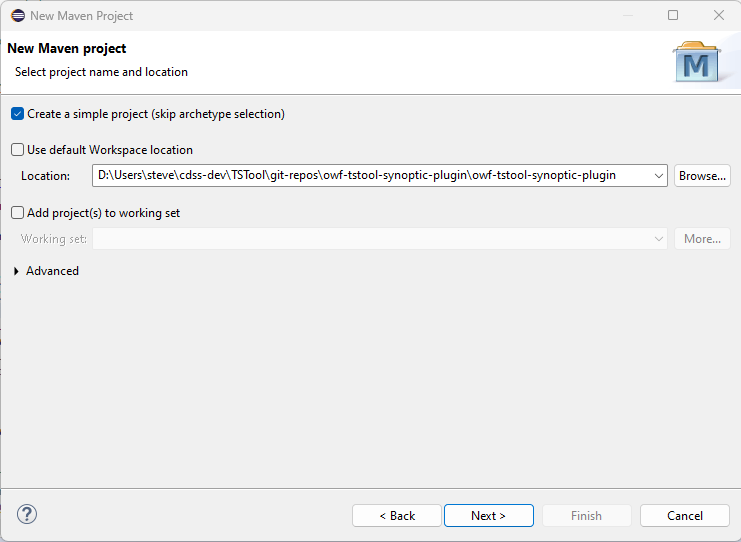
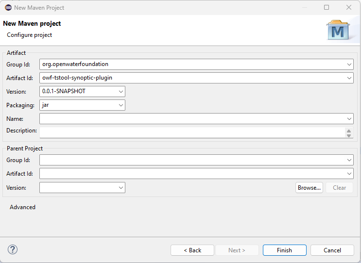

# Setting up the TSTool Synoptic Plugin

These instructions are for the first-time setup, used by the first developer.
The instructions are useful when initializing other plugins.

## Initialize the Repository ##

Create the GitHub public repository `owf-tstool-synoptic-plugin`.

Clone to the `TSTool/git-repos` folder on the computer.

Copy the `README.md`, `.gitignore`, `.gitattributes`, and `build-util/` files from the MADIS plugin repository.
Update the files to use the `owf-tstool-synoptic-plugin` and similar.

## Add a New Maven Project to Eclipse ##

Start the TSTool Eclipse environment by running the `cdss-app-tstool-main/build-util/run-eclipse-win64.cmd` command file
from a Windows command shell,
which is the normal TSTool run script.

Select ***File / New / Project... / Maven / Maven Project***.
Specify information as shown in the following image and press ***Next >***.
Redundant `owf-tstool-synoptic-plugin` folders are used, one for the Git repository folder working files,
and one for the Maven project with source files.
This allows other top-level folders to be created in the repository to separate major development files,
including documentation and tests.

Fill out the new maven project artifact properties as follows and press ***Finish***.

Commit the files to the repository.

## Configure the Project ##

Use the ***Package Explorer*** view.
Right-click on the `owf-tstool-synoptic-plugin` project and then use ***Build Path / Configure Build Path...***.
Under the ***Java Build Path / Projects*** tab, select ***Add...***.
Add the `cdss-lib-common-java` and `cdss-lib-processor-ts-java` projects,
which will provide general functionality needed by the plugin.

## Add Code Files ##

Add files similar to other plugins in order to enable the software functionality.
