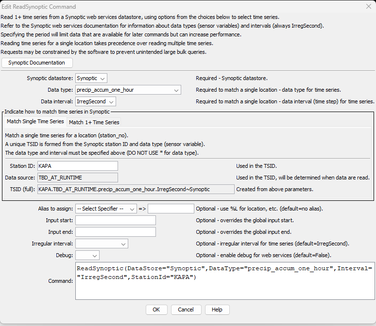

# TSTool / Command / ReadSynoptic #

*   [Overview](#overview)
*   [Command Editor](#command-editor)
    +   [Match Single Time Series](#match-single-time-series)
    +   [Match 1+ Time Series](#match-1-time-series)
*   [Command Syntax](#command-syntax)
*   [Examples](#examples)
*   [Troubleshooting](#troubleshooting)
*   [See Also](#see-also)

-------------------------

## Overview ##

The `ReadSynoptic` command reads one or more time series from Synoptic web services:

*   Read a single time series by matching a TSTool time series identifier (TSID).
*   Read 1+ time series using filters similar to the main TSTool window.

See the [Synoptic Data Web Services Appendix](../../datastore-ref/Synoptic/Synoptic.md)
for more information about Synoptic web service integration and limitations.
The command is designed to utilize web service query criteria to process large numbers of time series,
for example to produce real-time information products and perform historical data analysis and quality control.

See also the 
[TSID for Synoptic](../TSID/TSID.md) time series identifier command,
which reads time series for a single time series.

The ***Data type***, ***Data interval***, and ***Where*** command parameters and input fields
are similar to those in the main TSTool interface.
However, whereas the main TSTool interface first requires a query to find the
matching time series list and interactive select to copy specific time series identifiers into the ***Commands*** area,
the `ReadSynoptic` command automates reading the time series list and the corresponding data for the time series.

Using the `ReadSynoptic` command can greatly shorten command files and simplify command logic
when processing many time series.
However, because the command can process many time series and web services are impacted by network speed,
running the command can take a while to complete.
Checks are in place to constrain queries,
for example requiring that state or National Weather Service (NWS) County Warning Area (CWA) are specified.

Data for the location and other time series metadata,
as shown in the main TSTool interface, are set as time series properties, using web service data values.
Right-click on a time series in the TSTool ***Results*** area and then use the
***Time Series Properties*** menu to view time series properties.
These properties can be transferred to a table with the
[`CopyTimeSeriesPropertiesToTable`](https://opencdss.state.co.us/tstool/latest/doc-user/command-ref/CopyTimeSeriesPropertiesToTable/CopyTimeSeriesPropertiesToTable/)
command and processed further with other table commands.

Although TSTool can represent time series as regular interval,
where the timestamp is the interval-ending date/time (e.g., `15Minute`, `1Hour`),
Synoptic time series are currently always treated as irregular interval with the observation at the timestamp.
For example, data values for sensor variable `precip_accum_one_hour` have irregular timestamp and the
data value is the precipitation total in the hour ending at the timestamp.
Additional functionality may be enabled in the future as sensor variables are better understood.
        
## Command Editor ##

The following dialog is used to edit the command and illustrates the syntax for the command.
Two options are available for matching time series.

### Match Single Time Series ###

The following example illustrates how to read a single time series by specifying the data type and interval (top)
and location identifier and time series short name (***Match Single Time Series*** tab).
This approach is similar to using the general
[`ReadTimeSeries`](https://opencdss.state.co.us/tstool/latest/doc-user/command-ref/ReadTimeSeries/ReadTimeSeries/)
command but offers parameters specific to Synoptic web services.

**<p style="text-align: center;">

</p>**

**<p style="text-align: center;">
`ReadSynoptic` Command Editor to Read a Single Time Series (<a href="../ReadSynoptic-single.png">see also the full-size image)</a>
</p>**

### Match 1+ Time Series ###

The following figure illustrates how to query multiple time series.
For example, this can be used to process all time series of a data type in the system
or all time series for a location.
This example specifies two station identifiers in the filter.

**<p style="text-align: center;">

</p>**

**<p style="text-align: center;">
`ReadSynoptic` Command Editor to Read Multiple Time Series (<a href="../ReadSynoptic-multiple.png">see also the full-size image)</a>
</p>**

## Command Syntax ##

The command syntax is as follows:

```text
ReadSynoptic(Parameter="Value",...)
```

**<p style="text-align: center;">
Command Parameters
</p>**

|**Tab**|**Parameter**&nbsp;&nbsp;&nbsp;&nbsp;&nbsp;&nbsp;&nbsp;&nbsp;&nbsp;&nbsp;&nbsp;&nbsp;&nbsp;&nbsp;&nbsp;&nbsp;&nbsp;&nbsp;|**Description**|**Default**&nbsp;&nbsp;&nbsp;&nbsp;&nbsp;&nbsp;&nbsp;&nbsp;&nbsp;&nbsp;&nbsp;&nbsp;&nbsp;&nbsp;&nbsp;&nbsp;&nbsp;&nbsp;&nbsp;&nbsp;&nbsp;&nbsp;&nbsp;&nbsp;&nbsp;&nbsp;&nbsp;|
|--------------|-----------------|-----------------|--|
|All|`DataStore`<br>**required**|The Synoptic datastore name to use for the web services connection, as per datastore configuration files (see the [Synoptic Web Services Datastore appendix](../../datastore-ref/Synoptic/Synoptic.md)). | None - must be specified. |
||`DataType`<br>**required**|The data type to be queried, corresponding to Synoptic sensor variables. | `*` to read all the time series. |
||`Interval`<br>**required**|The data interval for the time series, currently always `IrregSecond`.  The interval is currently NOT used to filter time series because the sensor variable sometimes indicates the interval. | `*` - to read all the time series. |
|***Match Single Time Series***|`StationId`<br>**required**|The location identifier, corresponding to Synoptic `stid`. | None - must be specified to read a single time series. |
||`TSID`| A view-only value that indicates the time series identifier that will result from the input parameters when a single time series is queried. | |
|***Match 1+ Time Series***|`WhereN`|When reading 1+ time series, the “where” clauses to be applied.  The filters match the values in the Where fields in the command editor dialog and the TSTool main interface.  The parameters should be named `Where1`, `Where2`, etc., with a gap resulting in the remaining items being ignored.  The format of each value is:<br>`Item;Operator;Value`<br>Where `Item` indicates a data field to be filtered on, `Operator` is the type of constraint, and `Value` is the value to be checked when querying.|If not specified, the query will not be limited and very large numbers of time series may be queried.|
|All|`Alias`<br>|The alias to assign to the time series, as a literal string or using the special formatting characters listed by the command editor.  The alias is a short identifier used by other commands to locate time series for processing, as an alternative to the time series identifier (`TSID`).|None – alias not assigned.|
||`InputStart`|Start of the period to query, specified as a date/time with a precision that matches the requested data interval.|Read most recent 3 months of data.|
||`InputEnd`|End of the period to query, specified as a date/time with a precision that matches the requested data interval.|Read most recent 3 months of data.|
||`IrregularInterval` | Used with regular interval time series in cases where an interval is not yet supported (e.g., month and year) or there are data complexities, such as daily interval time series that do not align with midnight.  The resulting time series will have irregular interval (spacing) and date/time precision will match the interval (e.g., `IrregHour` will use hourly time precision). The parameter can have one of the following values.  High precision time is typically only used in special cases. <ul><li>`IrregYear`</li><li>`IrregMonth`</li><li>`IrregDay`</li><li>`IrregHour`</li><li>`IrregMinute`</li><li>`IrregSecond`</li><li>`IrregHSecond`</li><li>`IrregMilliSecond`</li><li>`IrregMicroSecond`</li><li>`IrregNanoSecond`</li></ul>| `IrregSecond` |
||`Timezone`| **Not implemented.** Time zone for output, used when the web services time zone is not the same as that of the station. This may be implemented in the future. | Output will use the local time zone for the station. |
||`Debug`| Used for troubleshooting:  `False` or `True`. | `False` |

## Examples ##

See the [automated tests](https://github.com/OpenWaterFoundation/owf-tstool-synoptic-plugin/tree/main/test/commands/ReadSynoptic/).

## Troubleshooting ##

Refer to the TSTool log file.  Use the
[`SetDebugLevel`](https://opencdss.state.co.us/tstool/latest/doc-user/command-ref/SetDebugLevel/SetDebugLevel/) command
to increase the amount of output for debugging.

## See Also ##

*   [`CopyTimeSeriesPropertiesToTable`](https://opencdss.state.co.us/tstool/latest/doc-user/command-ref/CopyTimeSeriesPropertiesToTable/CopyTimeSeriesPropertiesToTable/) command
*   [`ReadTimeSeries`](https://opencdss.state.co.us/tstool/latest/doc-user/command-ref/ReadTimeSeries/ReadTimeSeries/) command
*   [TSID for Synoptic](../TSID/TSID.md) command
*   [`WebGet`](https://opencdss.state.co.us/tstool/latest/doc-user/command-ref/WebGet/WebGet/) command
