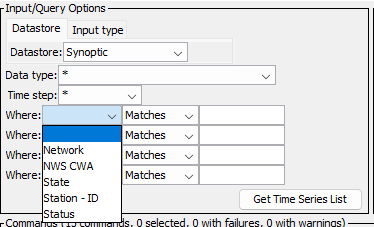

# TSTool / Datastore Reference / Synoptic Web Services #

*   [Overview](#overview)
*   [Standard Time Series Properties](#standard-time-series-properties)
*   [Other Specifications and Integration Considerations](#other-specifications-and-integration-considerations)
*   [Limitations](#limitations)
*   [Datastore Configuration File](#datastore-configuration-file)
*   [See Also](#see-also)

--------------------

## Overview ##

The Synoptic web services allow Synoptic Data web services to be queried by software,
including web applications and analysis tools such as TSTool.
TSTool accesses Synoptic web services using the Synoptic plugin.
Synoptic data are particularly useful for real-time operations.
However, long-term archival data may not be available.

See the following documentation:

*   [Synoptic Data](https://synopticdata.com/) web site.
*   [Synoptic API documentation](https://developers.synopticdata.com/mesonet/)
*   [Install Synoptic Plugin appendix](../../appendix-install/install.md)
*   [Synoptic TSID command](../../command-ref/TSID/TSID.md)
*   [`ReadSynoptic` command](../../command-ref/ReadSynoptic/ReadSynoptic.md)

TSTool primarily uses the Synoptic `metadata` service to list time series and retrieve time series metadata,
and the `timeseries` service to retrieve time series for display and analysis.

The TSTool [`WebGet`](https://opencdss.state.co.us/tstool/latest/doc-user/command-ref/WebGet/WebGet/)
command can be used to retrieve data from any web service and save to a file.
For example, a JSON format file can be saved and the resulting file can be read using commands such as
[`NewObject`](https://opencdss.state.co.us/tstool/latest/doc-user/command-ref/NewObject/NewObject/).
These general commands provide flexibility to retrieve data in addition to the specific Synoptic datastore commands.
See the [`SetPropertyFromDataStore`](https://opencdss.state.co.us/tstool/latest/doc-user/command-ref/SetPropertyFromDataStore/NSetPropertyFromDataStore/)
command (available in TSTool 14.7.0) to set a processor property from the `ApiToken` datastore property
so that the token can be used in `WebGet` commands without hard-coding the token.

## Web Service to Time Series Mapping ##

Time series data objects in TSTool consist of various properties such as location identifier, data type, units,
and data arrays containing data values and flags.
To convert Synoptic data to time series requires joining Synoptic station and sensor variable metadata,
and time series values for data.

The TSTool main interface browsing tool displays joined information in the time series list to select time series.
The Synoptic `getTimeseriesList` service provides data for the TSTool time series list.
The ***Data type*** and ***Time step*** are general filters implemented for all datastores and the
***Where*** input filters are specific to Synoptic.

**<p style="text-align: center;">

</p>**

**<p style="text-align: center;">
TSTool Where Filters
</p>**

## Standard Time Series Properties ##

The general form of time series identifier used by TSTool is:

```
LocationID.DataSource.DataType.Interval~DatastoreName
```

The standard time series identifier format for Synoptic web service time series is as follows.

```
STID.MNET.STATION_VARIABLE.IrregSecond~DataStoreName
STID.MNET.STATION_VARIABLE-STATION_VARIABLE_OUT.IrregSecond~DataStoreName
```

The following example show a case where only one sensor variable is found.

```
KAPA.ASOS/AWOS.precip_accum_one_hour.IrregSecond~Synoptic
```

The following example show a case where multiple same sensor variables are found
and the datatype contains a second part indicating the specific sensor variable.

```
CO001.CDOT.road_temp-road_temp_1.IrregSecond~Synoptic
```

The meaning of the TSID parts is as follows:

*   The `LocationId` is set to:
    +   Synoptic station identifier (`stid`).
*   The `DataSource` is set to:
    +   Synoptic network (`MNET` as short name).
    +   See the [Synoptic Station Networks & Providers](https://developers.synopticdata.com/about/station-providers/) web page
        for information about networks and maps showing stations in each network.
*   The `DataType` is set to:
    +   Synoptic station sensor variable (e.g., `precip_accum_one_hour`).
    +   If there are multiple sensors of the same variable type for the station,
        also include the numbered sensor variable,
        separated with a dash (e.g., `road_temp-road_temp_1`).
    +   See the Synoptic [Available Variables](https://developers.synopticdata.com/mesonet/v2/api-variables/) list.
*   The `Interval` is set to:
    +   `IrregSecond` in all cases.
    +   Regular intervals may be supported in the future.
*   The `DatastoreName` is taken from the datastore configuration file `Name` property:
    +   The datastore name is listed in the TSTool main interface.
    +   Multiple datastores can be configured, each pointing to a different Synoptic web service
        (e.g., if multiple versions are available).
        Therefore, datastore names should be assigned with enough detail to avoid confusion.
        The following are typical examples:
        -   `Synoptic` - general datastore name
        -   `SynopticV1` - if a version needs to be included
        -   `SynopticDev` - development version, if available

Important standard time series properties include:

1.  **Time Series Description**:
    1.  The Synoptic station `NAME` is used for the time series description, which is used in graph legends.
2.  **Data Units**:
    1.  The Synoptic `UNITS` are used for time series data units.
3.  **Missing Data Value**:
    1.  The special value `NaN` is used internally for the missing data value
        and is used when web service data values are reported as `null`.

See the next section for additional mapping of Synoptic data to TSTool time series.

## Other Specifications and Integration Considerations ##

The following are other specifications related to TSTool plugin integration with Synoptic web services.

1.  **Service URL**:
    1.  The configuration file `ServiceRootURI` property includes everything except specific service query parameters.
        This provides flexibility if the URL changes between TSTool software releases.
        See the [Datastore Configuration File](#datastore-configuration-file) section for an example.
2. **Data Caching:**
    1.  TSTool performance, in particular interactive features, is impacted by web service query times.
        Therefore, it is desirable to cache data in memory so that software does not need to requery web services.
        The trade-off is that when data are cached, changes in the Synoptic database will not be visible in the TSTool
        session unless TSTool rereads the data.
        There is a balance between performance and having access to the most recent data.
    2.  Currently, TSTool does cache some data such as network data.
        Howeever, because the Synoptic system has a large number of time series,
        TSTool does not currently cache time series metadata because preemptively caching large datasets is a performance hit.
    3.  Synoptic web services may implement data caching to improve performance.
        For example, content matching URLs may be cached for a short period (e.g., 1 minute) based on the system configuration.
3.  **Response Limits (Data Throttling)**:
    1.  Synoptic may throttle requests or enable access to more data and system features.
        See the Synoptic pricing for information.
    2.  TSTool may return an incomplete historical record if limits are less than the full time series period.
5.  **Time zone:**
    1.  Synoptic internally stores data in UTC and web service times and query parameters use UTC by default.
    2.  TSTool uses station local time zone for the query start and end and shows data in station local time.
    3.  Future plugin enhancements may allow time zone conversion.
6.  **Timestamp and Data Interval:**
    1.  Currently, TSTool handles all time series as irregular interval with default `IrregSecond` interval.
7.  **Observations:**
    1.  The time series data values are returned in an `OBSERVATIONS` array corresponding to sensor variable.
    2.  The data uses a name ending in, for example `_set` whereas the corresponding `metadata` service uses `_1`.
    3.  As many numbers are used as needed to provide unique datasets at the station.

## Limitations ##

The following limitations and design issues have been identified during development of the Synoptic plugin.
Additional software development is required to overcome these limitations.

1.  **Unique time series identifier:**
    1.  TSTool currently uses a combination of station ID and data type to uniquely identify time series.
        It may be necessary to also consider the network (TSTool TSID data source) for uniqueness.
    2.  The data interval in the TSID is not currently used to uniquely identify the time series and defaults to `IrregSecond`.
3.  **Time period:**
    1.  The Synoptic web services requires that the start and end are specified for `timeseries` requests.
    2.  Because this may result in slow performance, TSTool defaults the period to the most recent 3 months.
3.  **Regular interval time series:**
    1.  Regular interval time series are currently not handled by the TSTool Synoptic plugin.
        More information is needed about variables to understand whether any time series are regular interval.
4.  **Data flags:**
    1.  Data flags do not appear to be available from Synoptic web services.

## Datastore Configuration File ##

A datastore is configured by creating a datastore configuration file.

Create a user datastore configuration file `.tstool/NN/datastores/Synoptic.cfg` (or similar) in the user's files,
for example by copying and modifying the following example, or copying from another installation.
The `NN` should agree with the major TSTool version, for example `14` as shown by the ***Help / About TSTool*** menu.
TSTool will attempt to open datastores for all enabled configuration files.

The following illustrates the SynopticDataStore datastore configuration file format
and configures a datastore named `Synoptic`.
The `Name` property is the datastore name that will be used by the TSTool - the file name can be any name
but is often the same as the `Name` with extension `.cfg`.

```
# Configuration information for the Synoptic web service datastore.
# Properties are:
#
# Enabled - indicates if the datastore is enabled (active)
# ServiceApiDocumentationURI - URI for online API documentation
# Type - must be SynopticDataStore to find proper software
#
# The user will see the following when interacting with the data store:
#
# Name - data store identifier used in applications, for example as the
#     input type information for time series identifiers (usually a short string)
# Description - data store description for reports and user interfaces (short phrase)
# ServiceRootURI - web service root URI, including the server name and root path

Enabled = True
#Enabled = False
Type = "SynopticDataStore"
Name = "Synoptic"
Description = "Synoptic Data (Synoptic) web services"
ServiceRootURI = "https://api.synopticdata.com/v2"
ServiceApiDocumentationURI = "https://developers.synopticdata.com/mesonet/"
ApiToken = "INSERT_TOKEN_HERE"
```

**<p style="text-align: center;">
Synoptic Web Services DataStore Configuration File
</p>**

The following table describes configuration file properties.
See the [Synoptic Developers Getting Started](https://developers.synopticdata.com/mesonet/v2/getting-started/)
documentation for information about generating the API token.

**<p style="text-align: center;">
Synoptic  Web Services DataStore Configuration File Properties
</p>**

| **Property**&nbsp;&nbsp;&nbsp;&nbsp;&nbsp;&nbsp;&nbsp;&nbsp;&nbsp;&nbsp;&nbsp;&nbsp;&nbsp;&nbsp;&nbsp;&nbsp;&nbsp;&nbsp;&nbsp;&nbsp;&nbsp;&nbsp;&nbsp;&nbsp;&nbsp;&nbsp;&nbsp;&nbsp;&nbsp;&nbsp;&nbsp;&nbsp;&nbsp;&nbsp;&nbsp;&nbsp;&nbsp;&nbsp;&nbsp;&nbsp; | **Description** | **Default** |
| -- | -- | -- |
| `ApiToken`<br>**required** | API token to authenticate requests.  See the [Synoptic Getting Started with the Mesonet Web Services](https://developers.synopticdata.com/mesonet/v2/getting-started/) documentation. | None - must be specified. |
| `Description`<br>**required** | Description of the datastore, typically a short sentence, used in some displays. | None - must be specified. |
| `Enabled` | Indicates whether the datastore is enabled. | `True` |
| `Name`<br>**required** | Datastore name that is used in the TSTool software and Synoptic  commands.  The name should be unique across all datastores. | None - must be specified. |
| `ServiceApiDocumentationURI` | The URL for the web services API documentation, specific to the system.  This is used by software to display system-specific documentation. | Documentation will not be available from command editors. |
| `ServiceRootURI`<br>**required** | The root URL for the web services.  This should include everything except the service name and query parameters (the specific service name and query parameters are automatically specified by software to query data). | None - must be specified. |
| `Type`<br>**required** | Must be `SynopticDataStore`, which is used by TSTool to identify which plugin software to use for the datastore. | None - must be specified. |

## See Also 

*   [Synoptic TSID](../../command-ref/TSID/TSID.md) command
*   [`ReadDelimitedFile`](https://opencdss.state.co.us/tstool/latest/doc-user/command-ref/ReadDelimitedFile/ReadDelimitedFile/) command
*   [`ReadSynoptic`](../../command-ref/ReadSynoptic/ReadSynoptic.md) command
*   [`ReadTableFromDelimitedFile`](https://opencdss.state.co.us/tstool/latest/doc-user/command-ref/ReadTableFromDelimitedFile/ReadTableFromDelimitedFile/) command
*   [`ReadTableFromJSON`](https://opencdss.state.co.us/tstool/latest/doc-user/command-ref/ReadTableFromJSON/ReadTableFromJSON/) command
*   [`WebGet`](https://opencdss.state.co.us/tstool/latest/doc-user/command-ref/WebGet/WebGet/) command
